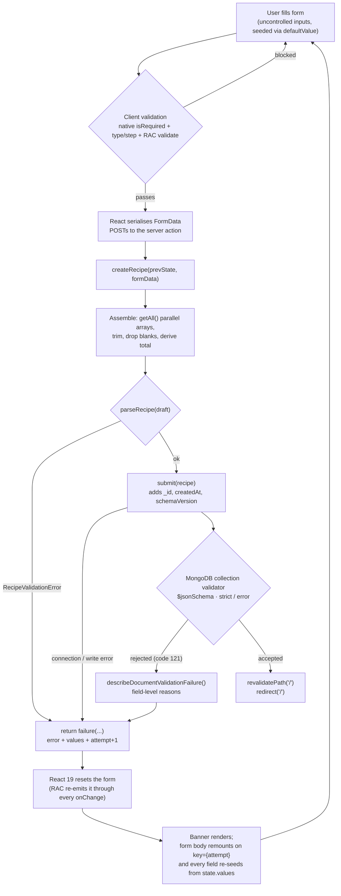

# The Create Recipe Form — End-to-End Guide

Everything about `/create`: how a recipe travels from keystroke to MongoDB
document, where validation lives and why it lives there, how `useActionState`
shapes the whole design, and which invariants you must not break.

Written against the implementation as of the `feature/create` branch.

---

## 1. File map

| Path                                                           | Role                                                                                   |
| -------------------------------------------------------------- | -------------------------------------------------------------------------------------- |
| `src/app/create/page.tsx`                                      | Server Component shell. Injects the action.                                            |
| `src/app/create/actions.ts`                                    | `createRecipe` — the server action. FormData → `Recipe` → DB.                          |
| `src/app/create/types.ts`                                      | `CreateRecipeState` / `CreateRecipeSubmittedValues` — the `useActionState` contract.   |
| `src/ui/components/organisms/CreateRecipeForm.tsx`             | The whole form. Client Component.                                                      |
| `src/ui/components/molecules/IngredientsField.tsx`             | Repeatable ingredient rows.                                                            |
| `src/ui/components/molecules/StringListField.tsx`              | Repeatable string rows (steps, tags).                                                  |
| `src/ui/components/molecules/PreparationTimesField.tsx`        | Prep / cook / derived total.                                                           |
| `src/ui/components/atoms/{TextField,TextArea,NumberField}.tsx` | Field primitives.                                                                      |
| `src/models/recipe/index.ts`                                   | `Recipe`, `Ingredient`, `DESCRIPTION_MAX_LENGTH`.                                      |
| `src/models/recipe/parse.ts`                                   | `parseRecipe` — the shared server-side validation gate.                                |
| `src/models/recipe/schema/recipe-validation-schema.json`       | MongoDB `$jsonSchema` — the collection validator.                                      |
| `src/models/recipe/schema/installValidator.ts`                 | Attaches that schema to the collection (`npm run db:validator`, also run by `predev`). |
| `src/lib/db/documentValidation.ts`                             | Translates a Mongo code-121 rejection into readable per-field messages.                |
| `src/lib/db/recipes/index.ts`                                  | `submit()` — the insert.                                                               |
| `src/app/api/recipes/route.ts`                                 | `POST /api/recipes` — the _other_ write path.                                          |

---

## 2. The lifecycle



The happy path **never returns** — `redirect()` throws a control-flow signal
that Next.js catches. That is why it must stay outside the `try/catch` around
`submit()`; catching it would swallow the redirect and report a save failure.

---

## 3. Route composition: why the action is a prop

`page.tsx` is a Server Component; `CreateRecipeForm` is `'use client'`.

```tsx
// page.tsx (server)
<CreateRecipeForm action={createRecipe} />
```

A server action is passed to a client component as a _reference_, not as code.
React serialises it to an opaque action ID; the client only ever holds a handle,
and invoking it performs an RPC back to the server. The function body never
reaches the browser.

**Why inject rather than import?** The organism could `import { createRecipe }`
directly, but then it would be welded to `/create`. As a prop, the organism is
reusable — an edit page could pass `updateRecipe` with the same signature — and
it stays testable in isolation. The prop type is the contract:

```ts
action: (prevState: CreateRecipeState, formData: FormData) =>
  Promise<CreateRecipeState>;
```

---

## 4. `useActionState` in depth

```tsx
const [state, formAction, isPending] = useActionState(
  action,
  CREATE_RECIPE_INITIAL_STATE,
);
```

| Return       | What it is                                                      |
| ------------ | --------------------------------------------------------------- |
| `state`      | Whatever the action last returned. Starts as the initial value. |
| `formAction` | A wrapped action to hand to `<form action={...}>`.              |
| `isPending`  | `true` while the action is in flight.                           |

### Why this hook rather than `useState` + `fetch`

1. **Progressive enhancement.** Form actions are designed to submit before
   hydration completes, where a click handler calling `fetch` would do nothing.
   (Not verified here with JS fully disabled — the form is wrapped in React
   Aria's `Form`, so treat this as the design intent, not a tested guarantee.)
2. **Pending state for free.** No manual `setLoading(true)` / `finally` pair,
   and no risk of a stuck spinner on an early return.
3. **The action signature carries state forward.** The previous state is the
   first argument, which is how `attempt` increments (see §7) without any
   client-side counter.
4. **No API route needed.** The action _is_ the endpoint.

### The one behaviour that shapes everything else

> **React 19 resets the form after a form action completes.**

Not only on success — on _any_ settle, including a returned error state.

**Being controlled is not protection.** React Aria re-emits that reset through
every field's `onChange`: `useTextField` registers
`useFormReset(ref, props.defaultValue ?? initialValue, setValue)`, and
`useControlledState`'s setter invokes `onChange` even in controlled mode
("Always trigger a re-render, even when controlled"). A controlled field is
therefore restored to whatever it held **at mount** — so holding title and
description in a `useState('')` was _actively wiping_ the user's text on every
failed save, not preserving it.

What does work is **seeding**. Because the reset restores
`props.defaultValue ?? initialValue`, a field that _mounts_ already holding the
submitted value is restored to that value. So every field — not just the
repeatable rows — is echoed back in `state.values` and re-seeded from it, and
the whole form body is keyed on `attempt` so a single remount re-reads every
`defaultValue` (§7, §8).

It is also why **per-field validation deliberately stays on the client**. If a
missing required field were reported by returning an error state, the round trip
would reset the form the user is trying to correct. Client-side validation is
inline, instant, and never triggers a reset.

---

## 5. The three validation layers

Validation is deliberately in three places. Each catches something the others
structurally cannot.

### Layer 1 — Client (`isRequired`, RAC `validate`, `maxLength`, `min`)

_Where:_ the atoms and the form JSX. _Purpose:_ fast, inline, per-field
feedback, and avoiding the form-reset problem above.

_Cannot be trusted._ It is bypassed by a disabled-JS submit, a crafted POST, or
devtools. It is a UX layer, not a security layer.

### Layer 2 — `parseRecipe` (server, authoritative)

_Where:_ `src/models/recipe/parse.ts`. _Purpose:_ the single authority on what a
valid `Recipe` is.

**Both write paths go through it:**

```
Browser form → createRecipe ──┐
                              ├──→ parseRecipe ──→ submit() ──→ MongoDB
POST /api/recipes ────────────┘
```

This matters because they used to disagree: the API accepted negative servings
and empty steps that the form rejected, and vice versa. One gate means one rule
set.

It takes `unknown` — not `Recipe`. That is the whole point:
`await request.json()` is typed `any`, and **`any` satisfies `Recipe` at compile
time no matter what it holds.** TypeScript reported a fully type-safe call on a
completely unvalidated HTTP body. `parseRecipe` is where that lie is caught.

It also **normalises**, not just validates: trims strings, drops blank array
entries, omits empty optional keys rather than storing `""`, recomputes
`preparationTimes.total`, and forces `schemaVersion`.

### Layer 3 — MongoDB `$jsonSchema`

_Where:_ `recipe-validation-schema.json`. _Purpose:_ last-resort integrity for
anything reaching the collection by another route (a script, a shell, a future
service).

Applied with `npm run db:validator`
(`src/models/recipe/schema/installValidator.ts`), at
`validationLevel: "strict"` / `validationAction: "error"`.

**Re-run it after `docker compose down -v`, a fresh clone, or any edit to the
schema file.** A plain `docker compose down`/`up` does _not_ lose it: the
validator lives in the collection's options inside the `mongo-data` named
volume, alongside the documents themselves. Editing the JSON alone changes
nothing until the script runs.

The installer refuses to attach if any stored document would fail, because
`strict` would then make those documents un-updatable. Override with `--force`
once you have decided what to do about them.

When the validator does reject something, `describeDocumentValidationFailure`
(`src/lib/db/documentValidation.ts`) flattens Mongo's `errInfo` tree into lines
like `ingredients[1].name is required`, which the form shows in its banner and
the API returns as a 422 `details` array.

> A rejection here means **`parseRecipe` and the schema have drifted** — input
> the gate approved that the database refused. Treat it as a bug to reconcile,
> not as routine user error.

### Where each rule actually lives

| Rule                      |                        Client                        |  `parseRecipe`  | Collection validator |
| ------------------------- | :--------------------------------------------------: | :-------------: | :------------------: |
| `name` present            |                          ✅                          |       ✅        |    ✅ (presence)     |
| `description` present     |                          ✅                          | — (allows `""`) |    ✅ (presence)     |
| `description` ≤ 280 chars |                 ✅ (native truncate)                 |       ✅        |          ✅          |
| `servings` present        |                          ✅                          |       ✅        |          ✅          |
| `servings` ≥ 1            |                          ✅                          | ❌ **allows 0** |          ❌          |
| Numbers non-negative      |                      ✅ (clamp)                      |       ✅        |          ❌          |
| Fractional values allowed | only where `step="any"` (i.e. `inputMode="decimal"`) |  ✅ any finite  |  ✅ `int`\|`double`  |
| ≥ 1 ingredient            |                          ✅                          |       ✅        |          ❌          |
| Ingredient `name` present |                          ✅                          |       ✅        |          ✅          |
| Ingredient `unit`         |                       optional                       |    optional     |       optional       |
| ≥ 1 non-blank step        |                          ✅                          |       ✅        |          ❌          |
| `visibility` enum         |                         n/a                          | ✅ (+ default)  |          ✅          |

The ❌ and the `—` in the `parseRecipe` column are known divergences,
deliberate and documented in §11 — not oversights.

---

## 6. FormData assembly and the zip invariant

Repeatable groups arrive as **repeated field names**, read with `getAll()`:

```ts
const names = formData.getAll('ingredientName');
const quantities = formData.getAll('ingredientQuantity');
const units = formData.getAll('ingredientUnit');
const notes = formData.getAll('ingredientNotes');
```

These four parallel arrays are zipped **by index**.

> 🔒 **Invariant:** every rendered ingredient row must emit _all four_ inputs,
> always, even when empty.

If a row conditionally omitted an input, every subsequent row's fields would
shift by one and silently attach to the wrong ingredient. This is why making
`unit` optional changed only the _validation_, never the rendering — the input
still renders and still submits an empty string. Steps and tags are simpler:
single repeated names read in document order.

### Field-by-field reference

| Form field                    | → `Recipe`                          | Notes                                              |
| ----------------------------- | ----------------------------------- | -------------------------------------------------- |
| `name`                        | `name`                              | Trimmed. Seeded from `state.values` (§8).          |
| `description`                 | `description`                       | Trimmed, capped at 280. Seeded (§8).               |
| `servings`                    | `servings`                          | `toNumber(...) ?? 0`.                              |
| `prepMinutes` / `cookMinutes` | `preparationTimes.prep` / `.cook`   | Either alone ⇒ other is 0.                         |
| `totalMinutes`                | —                                   | **Submitted but ignored.** Recomputed server-side. |
| `ingredient*` ×4              | `ingredients[]`                     | Zipped by index; fully-empty rows dropped.         |
| `step` (repeated)             | `steps[]`                           | Trimmed, blanks dropped.                           |
| `tag` (repeated)              | `tags[]`                            | Omitted entirely when empty.                       |
| nutrition ×7                  | `nutrition.*`                       | Each independently optional.                       |
| _(no input)_                  | `visibility`                        | Always `'private'` — no auth yet.                  |
| _(no input)_                  | `schemaVersion`, `createdAt`, `_id` | Server-owned.                                      |

`totalMinutes` being ignored is intentional: a client-derived total must never
be authoritative, since it is trivially forged and can drift from its inputs.

---

## 7. Repeatable rows: ids, seeding, and the remount

Rows are **uncontrolled** — React holds a list of row _ids_, the DOM holds the
values. The server reads the values from FormData.

```ts
const seedCount = defaultItems?.length ?? 0;
const nextId = useRef(Math.max(seedCount, 1));
const [rowIds, setRowIds] = useState(() =>
  seedCount ? defaultItems!.map((_, i) => i) : [0],
);
```

**The id scheme is load-bearing.** Seeded rows get ids `0..n-1`, matching their
index in `defaultItems`, so a row looks up its own seed with `defaultItems[id]`.
Rows added later get ids `>= n`, so that lookup is `undefined` and they render
blank. Removal never renumbers, so the mapping survives arbitrary add/remove.

### Why a `key` remount is required

React reads `defaultValue` **only on mount**. Re-rendering an input with a new
`defaultValue` does nothing at all. So the action returns an incrementing
`attempt`, used as a key on **one** wrapper around the whole form body:

```tsx
<div key={state.attempt} className="flex flex-col gap-6">
  {/* every fieldset */}
</div>
```

A changed key unmounts the old subtree and mounts a fresh one, whose `useState`
initialisers and `defaultValue`s run against the new seed. This is also why
`attempt` lives in the action's return value rather than in client state — the
action owns it, so the key changes exactly once per failed attempt.

One key on the body, rather than one per repeatable group, because §4 means
_every_ field needs re-seeding, not just the rows. The submit button sits
**outside** the keyed wrapper so it keeps focus across attempts.

> This works regardless of whether React's reset runs before or after the
> remount. If the reset lands first, the remount replaces those inputs with
> freshly seeded ones anyway; if it lands second, it restores each field to
> `props.defaultValue ?? initialValue`, which is now the submitted value.
> `defaultValue` also sets the DOM `value` _attribute_, which is precisely what
> a native form reset restores to.

---

## 8. What survives a failed submit

Everything, by **one** mechanism: the action echoes the submitted values back in
`state.values`, and the form body remounts on `key={state.attempt}` so every
field re-reads its `defaultValue`.

| Field                    | Seeded from                                                                | Survives?    |
| ------------------------ | -------------------------------------------------------------------------- | ------------ |
| Title, description       | `values.scalars.{name,description}`                                        | ✅ re-seeded |
| Servings, nutrition      | `values.scalars.*`                                                         | ✅ re-seeded |
| Prep / cook              | `values.scalars.{prepMinutes,cookMinutes}` → `PreparationTimesField` props | ✅ re-seeded |
| Ingredients, steps, tags | `values.{ingredients,steps,tags}`                                          | ✅ re-seeded |

> ⚠️ There is no "controlled so it survives" shortcut — see §4. Every new field
> must be added to `CreateRecipeSubmittedValues` and seeded, or the post-action
> reset silently blanks it.

The scalar fields are echoed as the **raw submitted strings**
(`CreateRecipeScalarValues`), not parsed numbers, so a field left blank comes
back blank rather than as `"0"`. The repeatable groups are echoed as parsed
values, so those restore **normalised**: trimmed, blanks dropped, a blank
quantity echoed back as `0`.

---

## 9. Atom contracts worth knowing

**`NumberField`** is controlled internally so it can **clamp** below `min`
(default 0) on change, announcing the clamp through a polite live region — a
silent correction would be a WCAG 3.3.1 failure. Being controlled does _not_
make it survive the form reset (§4); seeding it via `defaultValue` does.
Accepts `value`/`onChange` (as `PreparationTimesField` does) or self-manages
from `defaultValue`.

It also sets `step` on the native input, defaulting to **`'any'` when
`inputMode="decimal"`** and `1` otherwise. This is load-bearing, not cosmetic:
an `<input type="number">` with no `step` inherits HTML's default of `1`
(stepping from `min`), so `1.5` is a `stepMismatch` and — under the form's
`validationBehavior="native"` — the browser silently refuses to submit the
**entire form**. Without it, no recipe with a fractional quantity could be
saved at all. Give any new fractional field `inputMode="decimal"`.

**`TextArea`** enforces `maxLength` natively. The visible counter is
`aria-hidden` (announcing a number every keystroke is noise); a separate
`sr-only` `aria-live="polite"` region announces **once** when the cap is
reached. The message is a constant, so typing on at the limit does not
re-announce — which is why this needs no debounce.

**`Button`** — two accessibility details:

- The submit button takes `isPending` **only**, never `isDisabled`. React Aria
  already blocks the press, retypes `submit` → `button` so it cannot re-submit,
  and sets `aria-disabled` _while keeping the button focusable_. Adding
  `isDisabled` renders the native `disabled` attribute, which drops focus to
  `<body>` mid-submit and removes the element from the a11y tree.
- The `secondary` variant hard-codes `text-2xl`. That is **not** styling: at
  24px the label qualifies as WCAG "large text", dropping the contrast floor
  from 4.5:1 to 3:1, which is the only reason its gold fill can carry cream
  text. Shrinking it silently breaks contrast compliance.

Add/Remove row buttons are icon-only with `aria-label` (not `sr-only` text) —
the atom sizes icon buttons via `[&:has(>svg:only-child)]`, which an extra
`sr-only` span would defeat.

---

## 10. Failure modes

| What happens                    | User sees                                                                      | Logged                              |
| ------------------------------- | ------------------------------------------------------------------------------ | ----------------------------------- |
| Missing/invalid field, JS on    | Inline field error, no submit                                                  | —                                   |
| `parseRecipe` rejects           | Banner: `Please check your entries — <reason>.`                                | `createRecipe validation failed: …` |
| Collection validator rejects    | Banner: `The database rejected this recipe — ingredients[1].name is required.` | `createRecipe failed: …`            |
| DB down / write error           | Banner: `Sorry, we couldn't save your recipe. Please try again.`               | `createRecipe failed: <reason>`     |
| Non-validation throw in parsing | Rethrown → Next error boundary                                                 | Next's handler                      |
| Success                         | Redirect to `/`                                                                | —                                   |

The banner is `role="alert"`, so it is announced on appearance. A validation
banner should be _unreachable_ in normal use — reaching one means client
validation was bypassed or the client and server rule sets have drifted.

---

## 11. Known gaps

1. **`predev` only covers `npm run dev`.** `npm run build` / `npm start` do
   not attach the validator, so a production or CI database must have
   `npm run db:validator` run against it explicitly. A fresh volume there
   starts unvalidated and silent.
2. **`servings: 0` passes the server.** The form requires ≥ 1; `parseRecipe`
   allows 0 to stay aligned with the schema, which sets no minimum. Fix in the
   schema and parser together.
3. **Empty `description` passes the server.** The form requires it; the schema
   only requires the _key_ to exist, and `parseRecipe` matches the schema.
4. **`preparationTimes` rules differ by path.** The form's fill-either logic
   always sends both `prep` and `cook`, so `parseRecipe` requires both — API
   clients sending only one get a 400.
5. **`submit()` still has its own `name`/`ingredients` guard**, now redundant
   with `parseRecipe`. Harmless defence-in-depth; delete if it drifts.
6. **`visibility` has no UI.** Hard-wired to `'private'` until auth exists. The
   `RadioGroup` atom is built and unused, waiting for it.
7. **No image upload.** Optional in the schema; `parseRecipe` accepts and
   validates `image`, but nothing in the form emits it yet.
8. **`IngredientsField` and `StringListField` duplicate the row state machine.**
   A shared `useRepeatableRows(min)` hook would remove it.
9. **A rejected connection is cached for the life of a dev process.**
   `src/lib/db/client/index.ts` stores the promise from `client.connect()` in a
   global, so if it rejects, every later request re-awaits that same rejection
   and the dev server never recovers — even once Mongo is back. Needs a
   `.catch()` that clears the global so the next call retries. Out of scope for
   this form, but it is what you hit when testing the failure path (§12).
10. **Nothing enforces integer minutes or servings.** `step="1"` on those inputs
    is a client-side nicety only; `parseRecipe` accepts any finite non-negative
    number, so `POST /api/recipes` can store `prep: 0.1`, and
    `total: prep + cook` is then a raw float sum (`0.30000000000000004`).
11. **No test runner.** Everything here has been verified manually, including
    the failed-save path in a real browser.

---

## 12. Verifying changes

**The gate, without a browser.** `parseRecipe` is a pure function, so it can be
exercised directly. The `@/` alias needs rewriting for plain Node:

```bash
mkdir -p /tmp/gate
sed 's#@/models/recipe#./recipe.ts#' src/models/recipe/parse.ts > /tmp/gate/parse.ts
sed "s#from 'mongodb'#from 'node:util'#; s#ObjectId#Object#g" \
  src/models/recipe/index.ts > /tmp/gate/recipe.ts
# write a /tmp/gate/run.mjs importing './parse.ts', then:
node --experimental-strip-types /tmp/gate/run.mjs
```

**The API path, end to end.** Needs `docker compose up -d`:

```bash
curl -s -X POST http://localhost:3000/api/recipes \
  -H 'Content-Type: application/json' \
  -d '{"name":"T","description":"d","servings":2,
       "ingredients":[{"name":"x","quantity":1}],"steps":["s1"]}'
```

Expect `201` plus a document whose `visibility` is `"private"`.

**The form path.** Invoking a `useActionState` server action over raw HTTP means
reproducing React's RSC encoding — not worth it. Click through `/create`
instead. To exercise the failure path, `docker compose stop mongodb`, submit,
and confirm the banner appears **and every field you typed is still on screen** —
title, description, servings, prep/cook and nutrition included, not just the
repeatable rows. Those scalar fields are the regression-prone ones (§4), so
check them specifically. Put a **fractional quantity** (e.g. `2.25`) in an
ingredient row while you are there: if the form submits at all, `step` is
still wired correctly (§9).

Two things to expect, neither a bug in the form:

- The failure takes **~30s**. Nothing sets `serverSelectionTimeoutMS`, so the
  driver waits out its 30-second default before rejecting.
- Afterwards the dev server keeps failing even once Mongo is back, returning an
  instant 500 with the stale `ECONNREFUSED`. `src/lib/db/client/index.ts` caches
  the promise from `client.connect()`, so a _rejected_ one is cached for the
  life of the process. **Restart `npm run dev`** after testing this path.

**The collection validator.** Confirm it is actually attached — an empty
`options` means it is not:

```bash
URI=$(grep '^MONGODB_URI=' .env.local | cut -d= -f2- | tr -d '"')
docker exec -i recipe-cart-next-mongodb-1 mongosh "$URI" --quiet \
  --eval 'printjson(db.getSiblingDB("recipes").getCollectionInfos({name:"recipes"})[0].options)'
```

To exercise the rejection path you must bypass `parseRecipe` (it is stricter,
so nothing normally reaches the validator): call `submit()` directly with a
deliberately invalid document cast through `unknown`, and run
`describeDocumentValidationFailure` on what it throws.

`npm run dev` attaches it automatically via `predev`. That hook runs with
`--soft`, so a stopped database — **or a missing `.env.local`** — warns and lets
the dev server start anyway; running `npm run db:validator` directly stays strict
and exits non-zero.

For `--soft` to mean anything, every failure has to be **reachable by the
`.catch()`** at the bottom of `installValidator.ts`. Two things guard that, and
both are easy to undo by accident:

- the script is launched with `--env-file-if-exists=.env.local`, not
  `--env-file=` — Node exits with code **9** before running any JS when an
  `--env-file` target is missing, which no `.catch()` can intercept;
- `@/lib/db/client` is imported **dynamically inside the function**, because it
  throws on a missing `MONGODB_URI` while its module body evaluates — i.e.
  before the `.catch()` is even attached.

Either one reverted, and `npm run dev` hard-fails on any checkout without a
complete `.env.local`.

**Always:** `npm run lint`, `npx tsc --noEmit`, `npm run build`.

---

## 13. If you change X, check Y

| Change                                 | Also check                                                                               |
| -------------------------------------- | ---------------------------------------------------------------------------------------- |
| Add/remove an ingredient sub-field     | The four-array zip in `actions.ts`; every row must still emit every input                |
| Make a field optional/required         | All three layers (§5) — they drift silently                                              |
| Touch `Button`'s `base` or `secondary` | The `text-2xl` contrast dependency (§9)                                                  |
| Add a field to `Recipe`                | `parseRecipe`, the JSON schema, and the action's assembly                                |
| Add **any** input                      | Echo it in `CreateRecipeSubmittedValues` and seed it — controlled is not enough (§4, §8) |
| Add a fractional numeric field         | Give it `inputMode="decimal"` so `step="any"` (§9), or submit is blocked                 |
| Change `submit()`'s signature          | Both callers: the action and the API route                                               |
| Edit `recipe-validation-schema.json`   | Re-run `npm run db:validator`; the file alone is inert                                   |
| Loosen a rule in `parseRecipe`         | Whether the collection validator still rejects it (drift ⇒ 422)                          |
