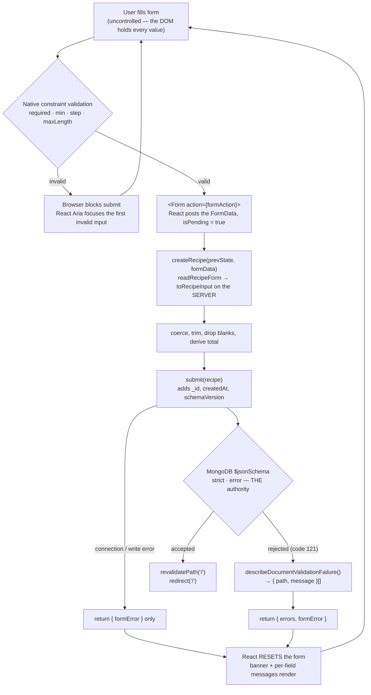

# The Create Recipe Form — End-to-End Guide

Everything about `/create`: how a recipe travels from keystroke to MongoDB document,
where validation lives and why it lives in exactly one place, and which invariants
you must not break.

Written against the implementation as of the `feature/create` branch.

---

## 1. File map

| Path                                                           | Role                                                                                   |
| -------------------------------------------------------------- | -------------------------------------------------------------------------------------- |
| `src/app/create/page.tsx`                                      | Server Component shell. Injects the action.                                            |
| `src/app/create/actions.ts`                                    | `createRecipe` — the server action. Shape → insert → translate a rejection.            |
| `src/models/recipe/form.ts`                                    | `RecipeFormValues`, `readRecipeForm`, `toRecipeInput`. **Shaping only, no rules.**     |
| `src/models/recipe/normalize.ts`                               | `normalizeRecipeBody` — the same contract for untrusted API bodies.                    |
| `src/models/recipe/schema/recipe-validation-schema.json`       | **The authority.** MongoDB `$jsonSchema` — every rule lives here.                      |
| `src/models/recipe/schema/installValidator.ts`                 | Attaches that schema to the collection (`npm run db:validator`, also run by `predev`). |
| `src/lib/db/documentValidation.ts`                             | Translates a code-121 rejection into `{ path, message }` a person can read.            |
| `src/ui/components/organisms/CreateRecipeForm.tsx`             | The whole form. Client Component.                                                      |
| `src/ui/components/molecules/IngredientsField.tsx`             | Repeatable ingredient rows.                                                            |
| `src/ui/components/molecules/StringListField.tsx`              | Repeatable string rows — steps, tags.                                                  |
| `src/ui/components/molecules/PreparationTimesField.tsx`        | Prep / cook / derived total.                                                           |
| `src/ui/components/atoms/{TextField,TextArea,NumberField}.tsx` | Field primitives. Presentational.                                                      |
| `src/models/recipe/index.ts`                                   | `Recipe`, `RecipeInput`, `Ingredient`, `DESCRIPTION_MAX_LENGTH`.                       |
| `src/lib/db/recipes/index.ts`                                  | `submit()` — the insert. Validates nothing, deliberately.                              |
| `src/app/api/recipes/route.ts`                                 | `POST /api/recipes` — the _other_ write path.                                          |

Relevant dependencies: `react-aria-components` and `mongodb`. **No form library and
no validation library** — see §4 and §5.

---

## 2. The lifecycle


```mermaid
flowchart TD
    A["User fills form<br/>(uncontrolled — the DOM holds every value)"] --> B{"Native constraint validation<br/>required · min · step · maxLength"}
    B -- invalid --> C["Browser blocks submit<br/>React Aria focuses the first invalid input"]
    C --> A
    B -- valid --> D["&lt;Form action={formAction}&gt;<br/>React posts the FormData, isPending = true"]
    D --> E["createRecipe(prevState, formData)<br/>readRecipeForm → toRecipeInput on the SERVER"]
    E --> F["coerce, trim, drop blanks, derive total"]
    F --> G["submit(recipe)<br/>adds _id, createdAt, schemaVersion"]
    G -- "connection / write error" --> H["return { formError } only"]
    G --> V{"MongoDB $jsonSchema<br/>strict · error — THE authority"}
    V -- "rejected (code 121)" --> R["describeDocumentValidationFailure()<br/>→ { path, message }[]"]
    R --> I["return { errors, formError }"]
    V -- accepted --> W["revalidatePath('/')<br/>redirect('/')"]
    H --> X["React RESETS the form<br/>banner + per-field messages render"]
    I --> X
    X --> A
```

The happy path **never returns** — `redirect()` throws a control-flow signal that
Next catches. That is why it must stay outside the `try/catch` around `submit()`;
catching it would swallow the redirect and report a phantom save failure.

Note where the shaping happens: the action receives the `FormData`, so
`readRecipeForm` and `toRecipeInput` both run **on the server**. The client never
reads the DOM.

---

## 3. Route composition: why the action is a prop

`page.tsx` is a Server Component; `CreateRecipeForm` is `'use client'`.

```tsx
// page.tsx (server)
<CreateRecipeForm action={createRecipe} />
```

A server action passed to a client component is a _reference_, not code. React
serialises it to an opaque action ID; the client only holds a handle, and calling it
performs an RPC. The function body never reaches the browser.

**Why inject rather than import?** The organism could `import { createRecipe }`
directly, but then it would be welded to `/create`. As a prop, the organism is
reusable — an edit page can pass `updateRecipe` with the same signature:

```ts
action: (prevState: CreateRecipeState, formData: FormData) =>
  Promise<CreateRecipeState>;
```

That is the `useActionState` signature React Aria's guide prescribes, so the same prop
accepts any action of that shape.

---

## 4. The platform validates; the platform submits

This is React Aria's documented server-function pattern, followed as written. There
is no form library and no schema library on the client, and the component holds **no
state of its own**:

```tsx
const [state, formAction, isPending] = useActionState(
  action,
  CREATE_RECIPE_INITIAL_STATE,
);

<RACForm
  validationBehavior="native"
  action={formAction}
  validationErrors={state.errors}
>
```

### Validation is the browser's

`validationBehavior="native"` hands it over. React Aria then:

- renders a real `required` attribute for `isRequired`, so **the browser blocks
  submission** (`useTextField`: `required: isRequired && validationBehavior === 'native'`);
- **focuses the first invalid input for you** — `useFormValidation`'s `onInvalid`
  checks `getFirstInvalidInput(form) === ref.current` and calls `focus()`, then
  `preventDefault()` to suppress the browser's own tooltip;
- renders the message through each atom's `<FieldError>`.

No error map, no touched set, no blur or change handlers.

### Submission is React's

The `action` prop takes the `formAction` from `useActionState`. React serialises the
form and the server action receives a real `FormData` — so the rendered element
carries `action="" encType="multipart/form-data" method="POST"`, and the form works
**without JavaScript** as a side effect.

The action's returned `errors`, keyed by input `name`, go to `validationErrors`, and
React Aria routes each message to the matching field through `FormValidationContext`
— including nested paths like `ingredients.1.name`. Keys matching no input are ignored
by RAC, which is why `formError` carries the full list in the banner: nothing is
silently dropped.

`isPending` comes from the hook, so there is no `useTransition` and no `onSubmit`.

> ⚠️ **React resets this form once the action settles** — on any settle, including a
> returned error. `startHostTransition` in `react-dom-client` wraps a non-null action:
>
> ```js
> null === action
>   ? noop
>   : function () {
>       requestFormReset$1(formFiber);
>       return action(formData);
>     };
> ```
>
> The reset is a native `HTMLFormElement.reset()` via `fiber.stateNode.reset()`, which
> restores every control to its `value` attribute; React Aria also listens for the
> resulting `reset` event in `useFormReset`, so controlled fields are restored to
> `props.defaultValue ?? initialValue` too. **No field is exempt.** Every input here is
> uncontrolled with no `defaultValue`, so a failed save clears the whole form.
>
> **This is an accepted trade, not an oversight.** Native constraints catch everything
> a user can actually fix, so a returned error means schema drift (§5) or an outage —
> rare either way. The cost is that when it does happen, a fully typed recipe is lost
> and has to be retyped.
>
> **To preserve input instead**, take the other half of the guide's server-validation
> example: echo every submitted value back in `CreateRecipeState` and seed each field
> with `defaultValue={state.values?.…}`. React writes the `value` attribute on
> re-render (`setDefaultValue` in `react-dom-client`, reached from `updateInput`, not
> only on mount), so the reset then restores the submitted value rather than blank.
> Anything added this way must be echoed **and** seeded, or that one field silently
> blanks while its neighbours survive. See §8.

## 5. One authority, two mirrors, zero validators in between

Validation lives in **one** place: the collection's `$jsonSchema`. It is the only
boundary nothing can write around — not this form, not `POST /api/recipes`, not a
script or a `mongosh` shell. Making it the authority removes rule-set drift by
construction rather than by documented invariant.

```
Form  → readRecipeForm → toRecipeInput      ──┐
                                              ├──→ submit() ──→ $jsonSchema ──→ stored
POST /api/recipes → normalizeRecipeBody     ──┘                     │
                                                                    └─ code 121
                                                      describeDocumentValidationFailure()
```

### The shaping layer rejects nothing

`toRecipeInput` (form) and `normalizeRecipeBody` (API) do the work a schema cannot:
trim, drop blank array entries, omit empty optional keys rather than storing `""`,
recompute `preparationTimes.total`, and default `visibility`.

> 🔒 **Neither one may ever reject.** They shape what they recognise and pass
> everything else through **unchanged**, so the validator sees the offending value and
> explains it. A guard here produces a plain `Error`, which callers can only report as
> a 500 — instead of a code-121 that names the field. It is also why `submit()` holds
> no checks of its own.
>
> They differ in how they achieve it, because their inputs differ:
>
> - **`normalizeRecipeBody`** takes an arbitrary JSON body, so it must be defensive
>   everywhere: `typeof v === 'string' ? v.trim() : v`, never `v.trim()`.
> - **`toRecipeInput`** may assume every field is a string, because its only caller
>   feeds it `readRecipeForm` output — and the action reads the `FormData` itself, so
>   no other shape can reach it. That is the safety the documented `(prevState,
formData)` signature buys: `readRecipeForm` reads only the keys it knows, each with
>   a `''` fallback, so a crafted payload cannot smuggle in a non-string. Widen
>   `toRecipeInput`'s callers and it has to become defensive too.

`normalizeRecipeBody` additionally strips `_id`, `createdAt` and `schemaVersion`:
they are server-owned, and passing a caller's values through would only produce a
confusing type error. `submit()` sets the latter two _after_ spreading the caller's
object, so they cannot be overridden either way.

### `additionalProperties: false` is the allowlist

Set at the root and on every nested object. This is load-bearing, not tidiness: it
**is** the field allowlist. The shaping layer deliberately does not strip unknown
keys, so without this a crafted `POST` body would persist arbitrary extra fields.
With it, the response says `"evil" is not a recognised field.`

### The client mirrors the schema

Native attributes are the inline UX for rules the schema owns. They are a **mirror,
not a source** — nothing ties them together automatically, so keep them in step:

| Rule                        | Input attribute                      | `$jsonSchema`                     |
| --------------------------- | ------------------------------------ | --------------------------------- |
| title / description present | `isRequired`                         | `required` + `minLength: 1`       |
| description ≤ 280           | `maxLength={280}`                    | `maxLength: 280`                  |
| servings ≥ 1                | `min={1}`                            | `minimum: 1`                      |
| servings a whole number     | `step={1}` (NumberField default)     | `multipleOf: 1`                   |
| minutes ≥ 0, whole          | `min={0}` + `step={1}`               | `minimum: 0` + `multipleOf: 1`    |
| nutrition ≥ 0               | `min={0}`                            | `minimum: 0`                      |
| fractional quantity allowed | `inputMode="decimal"` ⇒ `step="any"` | `["int","double"]`, no multipleOf |
| ingredient name / step text | `isRequired` per row                 | `minLength: 1`                    |
| ≥ 1 ingredient, ≥ 1 step    | one required row always rendered     | `minItems: 1`                     |
| visibility enum             | n/a (hard-wired)                     | `enum` + default in shaping       |
| no unknown fields           | n/a (fixed field set)                | `additionalProperties: false`     |

> 🔒 **Keep the client at least as strict as the schema.** Then a user never hits a
> database error for input the form accepted. If the client is _looser_, a real user
> sees a schema-worded message (see §11.3); if the schema is looser, a crafted
> payload gets in.

Re-run `npm run db:validator` after any schema edit — **the file alone is inert.**
Re-run it after `docker compose down -v` or a fresh clone too. A plain
`docker compose down`/`up` does _not_ lose it: the validator lives in the
collection's options inside the `mongo-data` named volume, alongside the documents.

The installer refuses to attach if any stored document would fail, because `strict`
would then make those documents un-updatable. Override with `--force` once you have
decided what to do about them.

---

## 6. Form values and the mapping to `Recipe`

### Numbers are held as strings

Every numeric field's value is a **string**, exactly as the input reports it — `''`
when untouched. An untouched field stays distinguishable from a deliberate `0`
(coercing at the input would collapse both into `NaN`), and coercion happens in
exactly one place, `toRecipeInput`.

### Every input binds to the path the database stores

```
ingredients.0.name   ingredients.0.quantity   ingredients.0.unit   ingredients.0.notes
steps.0   steps.1   tags.0   nutrition.sugar   preparationTimes.prep
```

`steps` and `tags` are plain `string[]`, named `steps.0`, not `steps.0.value`. That
identity is deliberate: a validator message about `steps.0` lands on the very input
that produced it, with no path translation.

### Reading the form: `readRecipeForm`

Its **shape** is guaranteed by construction — every key is read with a `''` fallback.
Nothing judges the values. Row counts are **probed**, not passed in, which keeps it a
pure function of the FormData:

```ts
for (let i = 0; formData.has(`ingredients.${i}.name`); i++) {
  /* push row */
}
```

> 🔒 **Submitted row indices must stay contiguous.** The probe stops at the first
> gap, so a hole at index 1 silently truncates the list. This is why rows render
> their `name` from the **render index** rather than from their React key (§7). A
> list the user emptied needs no special case — the loop yields `[]`.

### Field-by-field reference

| Form field                                 | → stored                            | Notes                                                |
| ------------------------------------------ | ----------------------------------- | ---------------------------------------------------- |
| `name`                                     | `name`                              | Trimmed.                                             |
| `description`                              | `description`                       | Trimmed; `maxLength` also blocks typing past 280.    |
| `servings`                                 | `servings`                          | Whole number ≥ 1.                                    |
| `preparationTimes.{prep,cook}`             | `preparationTimes.{prep,cook}`      | Either alone ⇒ the other is 0.                       |
| _(no input)_                               | `preparationTimes.total`            | Derived for display, recomputed when shaping.        |
| `ingredients.N.{name,quantity,unit,notes}` | `ingredients[N]`                    | Empty `unit`/`notes` omitted, not stored as `""`.    |
| `steps.N`                                  | `steps[]`                           | Each row required; trimmed; blanks dropped.          |
| `tags.N`                                   | `tags[]`                            | Blank rows dropped; key omitted when empty.          |
| `nutrition.*` ×7                           | `nutrition.*`                       | Each independently optional.                         |
| _(no input)_                               | `visibility`                        | Always `'private'` — no auth yet.                    |
| _(no input)_                               | `schemaVersion`, `createdAt`, `_id` | Server-owned; `submit()` sets them after the spread. |

Total minutes is **not a form value**. `PreparationTimesField` derives it for display
and `toRecipeInput` computes it authoritatively, so there is no client-supplied total
for anyone to forge and nothing for the two to disagree about.

---

## 7. Repeatable rows

Each molecule keeps a list of row **ids** and a counter:

```ts
const nextId = useRef(1);
const [rowIds, setRowIds] = useState<number[]>([0]);
```

Two different numbers are in play, and mixing them up is the bug to avoid:

|                           | Used for            | Why                                                                                                                                          |
| ------------------------- | ------------------- | -------------------------------------------------------------------------------------------------------------------------------------------- |
| **Row id** (stable)       | the React `key`     | React keeps each row's DOM — and therefore its typed values — across a removal. An index key would reuse one row's DOM for another's values. |
| **Render index** (shifts) | each input's `name` | `readRecipeForm` probes `0, 1, 2…` and stops at the first gap, so submitted keys must stay contiguous (§6).                                  |

React rewrites the `name` attribute on re-render while the DOM value stays with the
keyed element, so removing a row renumbers the survivors correctly. Nothing else has
to be kept in step — there is no client-side error map keyed by index.

Minimums are enforced twice for two reasons: the schema's `minItems: 1` is the rule,
and disabling the last row's remove button keeps the UI from reaching a state the
rule forbids. Optional lists (tags) can empty out entirely and start with no rows.

---

## 8. What survives a failed submit

**Nothing.** React resets the form once the action settles (§4), every field is
uncontrolled with no `defaultValue`, so a returned error leaves the user looking at an
empty form — with the messages correctly placed on the fields that caused them.

That is deliberate. It is also the one part of the design with a real cost, so know
when it bites:

| Cause of a returned error          | How likely                                                |
| ---------------------------------- | --------------------------------------------------------- |
| A rule a user can break            | Never — native constraints block submission first         |
| Native attributes ⇄ schema drift   | Only after an unsynchronised change (§5)                  |
| Database unreachable / write error | An outage, not an edge case — and it loses a typed recipe |

**To preserve input**, echo and seed, per §4's note:

1. add the submitted values to `CreateRecipeState` (the action already has the
   `FormData`, so `readRecipeForm(formData)` is the echo);
2. give every field `defaultValue={state.values?.…}`, including the controlled prep
   and cook fields in `PreparationTimesField`;
3. seed the repeatable molecules from the echoed rows so row counts survive too.

> ⚠️ Once that exists, **every new input must be echoed and seeded**, or it alone
> blanks on a failed save while its neighbours survive — a silent, per-field failure
> mode. That is the price of the `action` prop, and the reason the form does not pay it
> today.

---

## 9. Atom contracts worth knowing

The atoms are **presentational** and hold no refs. They accept `isInvalid` and
`errorMessage` as an escape hatch, but this form passes neither: a field is wired by
giving it a `name`, the browser decides validity, and React Aria routes any
server-reported message from `validationErrors` (§4).

```tsx
<TextField name="name" label="Title" isRequired />
```

**`NumberField`** is a `TextField` with `type="number"`; its value is a string (§6).
It does not correct what the user types — an out-of-range entry is refused by the
browser with a message rather than silently clamped (a silent correction is a WCAG
3.3.1 problem, an explicit message is not).

> ⚠️ **`step` is load-bearing, not cosmetic.** An `<input type="number">` with no
> `step` inherits HTML's default of `1` (stepping from `min`), so `1.5` is a
> `stepMismatch` and the browser **silently refuses to submit the entire form** — no
> error anywhere. Any field accepting fractions must carry `step="any"`, which
> `inputMode="decimal"` sets for you. Conversely `step={1}` is how the whole-number
> rule is mirrored on the client.

**`TextArea`** enforces `maxLength` natively. The visible counter is `aria-hidden`
(announcing a number every keystroke is noise); a separate `sr-only`
`aria-live="polite"` region announces **once** when the cap is reached. The message
is a constant, so typing on at the limit does not re-announce — which is why this
needs no debounce.

**`Button`** — two accessibility details:

- The submit button takes `isPending` **only**, never `isDisabled`. React Aria already
  blocks the press, retypes `submit` → `button` so it cannot re-submit, and sets
  `aria-disabled` _while keeping the button focusable_. Adding `isDisabled` renders
  the native `disabled` attribute, which drops focus to `<body>` mid-submit and
  removes the element from the a11y tree.
- The `secondary` variant hard-codes `text-2xl`. That is **not** styling: at 24px the
  label qualifies as WCAG "large text", dropping the contrast floor from 4.5:1 to
  3:1, which is the only reason its gold fill can carry cream text. Shrinking it
  silently breaks contrast compliance.

Add/Remove row buttons are icon-only with `aria-label` (not `sr-only` text) — the
atom sizes icon buttons via `[&:has(>svg:only-child)]`, which an extra `sr-only` span
would defeat.

---

## 10. Failure modes

| What happens                  | User sees                                                                             | Logged                   |
| ----------------------------- | ------------------------------------------------------------------------------------- | ------------------------ |
| Invalid field, client-side    | Browser blocks submit, reports it, focus moves to the first invalid input             | —                        |
| Validator rejects (drift)     | Banner with every message, plus each one on its field: `Servings must be at least 1.` | `createRecipe failed: …` |
| Validator rejects an API body | `422` + `details: [...]`                                                              | —                        |
| DB down / write error         | Banner: `Sorry, we couldn't save your recipe. Please try again.`                      | `createRecipe failed: …` |
| Malformed JSON body           | `400` + `Request body must be valid JSON`                                             | —                        |
| Success                       | Redirect to `/`                                                                       | —                        |

In every failure case React resets the form, so the user is looking at empty fields
with the messages placed correctly on them (§8).

Reaching a 121 **from the form** means the native attributes and the schema have
drifted (§5) — the client should have caught anything a user can fix. Treat it as a
bug to reconcile. From the API it is routine.

---

## 11. Known gaps

1. **`predev` only covers `npm run dev`.** `npm run build` / `npm start` do not attach
   the validator, so a production or CI database must have `npm run db:validator` run
   against it explicitly. A fresh volume there starts unvalidated and silent.
2. **A failed save clears the form.** Inherent to the `action` prop (§4), accepted
   because native validation makes a returned error rare — but an outage still costs
   a fully typed recipe. §8 has the echo-and-seed recipe if that becomes
   unacceptable.
3. **Client messages are browser-worded.** "Please fill out this field." / "Value must
   be greater than or equal to 1." — wording varies by browser and the locale is the
   _browser's_, not the app's, which cuts against `ClientProviders`' i18n. Custom
   wording would need a React Aria `validate` prop per field (~14 functions,
   client-only), which is a scattered hand-rolled schema. Deliberately not done.
4. **Two mirrors, no automatic link.** The native attributes and the `$jsonSchema` are
   kept in step by hand (§5's table). Nothing fails the build if they diverge; the
   conformance check in §12 is what catches it.
5. **Calories are whole-number on the client only.** `step={1}` (no `inputMode`)
   blocks a fractional entry, but the schema has no `multipleOf` for it, so
   `POST /api/recipes` can store `calories: 320.5`. Client-stricter, so it is the safe
   direction — add `multipleOf: 1` if the API path starts to matter.
6. **`preparationTimes` rules differ by path.** The form's fill-either logic always
   sends both `prep` and `cook`, and the schema `required`s all three — so an API
   client sending only `prep` gets a 422.
7. **`visibility` has no UI.** Hard-wired to `'private'` in the shaping layer until
   auth exists. The `RadioGroup` atom is built and unused, waiting for it.
8. **No image upload.** Optional in the schema, which validates it (`oneOf` upload |
   url), but nothing in the form emits it yet.
9. **A rejected connection is cached for the life of a dev process.**
   `src/lib/db/client/index.ts` stores the promise from `client.connect()` in a global,
   so if it rejects, every later request re-awaits that same rejection and the dev
   server never recovers — even once Mongo is back. Needs a `.catch()` that clears the
   global. It is what you hit when testing the failure path (§12).
10. **A stray `recipecart.recipes` collection exists** alongside the real
    `recipes.recipes`, with a validator attached and no documents. `MONGODB_DB_NAME`
    (`recipes`) is what the app uses; the URI's `/recipecart` path is ignored by
    `getDb()`. Harmless, but it makes a `mongosh` command that forgets
    `getSiblingDB("recipes")` return a plausible-looking wrong answer.
11. **No test runner.** The shaping functions are pure and the validator is
    exercised by a script (§12), but nothing covers the browser interaction —
    native-validation timing, row add/remove, the banner. It is the one area where a
    regression would be silent.

---

## 12. Verifying changes

**Validator conformance — the most important check.** The schema is the authority, so
this is where its rules are actually tested. Needs `docker compose up -d`. Attempt
inserts of deliberately-bad documents straight through `submit()` and translate what
comes back:

```ts
// in a scratch .ts at the project root (bare imports resolve from there)
import { getDb } from '@/lib/db/client';
import { describeDocumentValidationFailure } from '@/lib/db/documentValidation';
// … for each bad doc: insertOne, catch, describeDocumentValidationFailure(reason)
```

```bash
npx tsx --env-file=.env --env-file-if-exists=.env.local ./.conform.ts
```

Cover at least: empty title, `servings: 0`, `servings: 1.5`, `servings: "two"`, no
ingredients, a blank step, negative calories, fractional prep, an unknown top-level
key, an unknown nested key, a missing required field, and a bad row at index 1.
Assert for every case that it is **rejected**, that each `path` matches a real input
`name`, and that no message contains Mongo prose ("satisfied", "comparison failed",
"did not match"). Add a case whenever you add a rule.

**The shaping functions, without a database.** Both are pure:

- `readRecipeForm` — build a `FormData`, assert row counts, that a **gap at index 1
  truncates** the list, that an absent `tags.*` yields `[]`, and that stray keys the
  form never emits are ignored.
- `normalizeRecipeBody` — feed it `null`, `42`, `'str'`, `[]` and objects with wrong
  types and assert it **never throws**; assert `_id`/`createdAt`/`schemaVersion` are
  stripped, blank optionals omitted, and `total` recomputed from its parts.

**The action, end to end.** `createRecipe(prevState, formData)` can be called from a
script — build the `FormData` by hand (wrap in an `async main()`; a file outside the
project is treated as CJS, so top-level `await` will not compile):

```ts
const fd = new FormData();
fd.set('name', 'ACTION FD');
fd.set('servings', '4');
fd.set('ingredients.0.name', 'Tomatoes');
fd.set('steps.0', 'Mix');
await createRecipe(CREATE_RECIPE_INITIAL_STATE, fd);
```

Expect an invalid payload to **return** `{ errors, formError }` with real input names
as keys, and a valid one to insert and then throw
`Invariant: static generation store missing in revalidatePath` — that error is the
proof the happy path was reached. Query the collection, then delete the document.

Also pass **hostile** FormData — an empty one, and one carrying `__proto__`,
`ingredients: "not-an-array"` and unknown keys. Every case must come back as a
returned state with readable messages, never an unexpected throw: `readRecipeForm`
reads only the keys it knows, each with a `''` fallback, which is what keeps
`toRecipeInput` safe (§5).

**The API path.** Needs the dev server:

```bash
post() { curl -s -X POST localhost:3000/api/recipes -H 'Content-Type: application/json' -d "$2" -w " [%{http_code}]\n"; }
post valid    '{"name":"T","description":"d","servings":2,"ingredients":[{"name":"x","quantity":1}],"steps":["s1"]}'
post bad      '{"name":"","description":"d","servings":0,"ingredients":[{"name":"x","quantity":1}],"steps":["s1"]}'
post unknown  '{"name":"T","description":"d","servings":2,"ingredients":[{"name":"x","quantity":1}],"steps":["s1"],"evil":"x"}'
```

Expect `201`; `422` with readable `details`; `422` naming the unrecognised field
(this is the `additionalProperties: false` allowlist). Also POST an `_id` and a
`schemaVersion` and confirm the stored document has a generated ObjectId and
`schemaVersion: 1`.

**The wiring, from the served HTML.** These catch the §4/§5 breakages without a
browser:

```bash
H=$(curl -s http://localhost:3000/create)
echo "$H" | grep -c 'noValidate'                         # 0 — must stay native
echo "$H" | grep -o '[^-]required=""' | wc -l             # 6
echo "$H" | grep -o 'aria-required' | wc -l               # 0
echo "$H" | grep -oE '<form[^>]*' | grep -c 'action='     # 1 — the server action
echo "$H" | grep -oE 'step="[^"]*"' | sort | uniq -c      # 5× "1", 7× "any"
echo "$H" | grep -oE 'name="[a-zA-Z0-9_.]+"' | sort -u
```

A `noValidate`, or `aria-required` in place of `required`, means `validationBehavior`
has slipped to `aria`, which leaves nothing blocking submission. The form **must**
carry `action` (plus `encType="multipart/form-data" method="POST"`) — losing it means
the `useActionState` wiring broke and submitting does nothing. The `step` counts are
the guard on §9: a fractional field that loses `step="any"` silently blocks the whole
form.

**The collection validator is attached — to the right database:**

```bash
URI=$(grep '^MONGODB_URI=' .env.local | cut -d= -f2- | tr -d '"')
docker exec -i recipe-cart-next-mongodb-1 mongosh "$URI" --quiet \
  --eval 'printjson(db.getSiblingDB("recipes").getCollectionInfos({name:"recipes"})[0].options)'
```

`getSiblingDB("recipes")` is **required**: `MONGODB_DB_NAME=recipes` is what `getDb()`
uses, while the URI's `/recipecart` path is ignored. Omit it and you read the stray
empty `recipecart.recipes` collection (§11.9), which also has a validator attached —
so you get a plausible answer about the wrong database.

`npm run dev` attaches it automatically via `predev`. That hook runs with `--soft`, so
a stopped database — **or a missing `.env.local`** — warns and lets the dev server
start anyway; running `npm run db:validator` directly stays strict and exits non-zero.

For `--soft` to mean anything, every failure has to be **reachable by the `.catch()`**
at the bottom of `installValidator.ts`. Two things guard that, both easy to undo by
accident:

- the script is launched with `--env-file-if-exists=.env.local`, not `--env-file=` —
  Node exits with code **9** before running any JS when an `--env-file` target is
  missing, which no `.catch()` can intercept;
- `@/lib/db/client` is imported **dynamically inside the function**, because it throws
  on a missing `MONGODB_URI` while its module body evaluates — i.e. before the
  `.catch()` is even attached.

**By hand in a browser.** Worth doing specifically:

- Submit empty — the browser blocks it and focus lands on the title.
- A fractional quantity `2.25` submits; `1.5` servings is rejected.
- Add and remove ingredient and step rows, then submit, and confirm the right values
  are saved (this is the row-id vs render-index contract, §7).
- `docker compose stop mongodb`, submit, and confirm the banner appears. Expect the
  form to be **empty** afterwards — that is §8's accepted trade, not a bug. If you
  ever implement echo-and-seed, this is the check that proves it works.

Two things to expect there, neither a bug in the form:

- The failure takes **~30s** — nothing sets `serverSelectionTimeoutMS`, so the driver
  waits out its 30-second default.
- Afterwards the dev server keeps failing even once Mongo is back, returning an
  instant 500 with a stale `ECONNREFUSED` (§11.8). **Restart `npm run dev`.**

**Always:** `npm run lint`, `npx tsc --noEmit`, `npm run format:check`, `npm run build`.

---

## 13. If you change X, check Y

| Change                                 | Also check                                                                                       |
| -------------------------------------- | ------------------------------------------------------------------------------------------------ |
| Add or change **any rule**             | `recipe-validation-schema.json` **and** the mirroring input attribute (§5's table)               |
| Edit `recipe-validation-schema.json`   | Re-run `npm run db:validator`; the file alone is inert                                           |
| Add a new schema operator              | `describeLeaf` needs a branch, or it leaks raw Mongo prose into the UI                           |
| Add **any** input                      | `readRecipeForm`, `toRecipeInput`, and the schema's `properties` (`additionalProperties: false`) |
| Add a nutrition field                  | Nothing — the `NUTRITION_KEYS` loop stops compiling until you do                                 |
| Add a fractional numeric field         | Give it `inputMode="decimal"` so `step="any"`, or the browser blocks the whole form (§9)         |
| Add validation to a shaping function   | Don't — it must never reject, or a 121 becomes a 500 (§5)                                        |
| Implement echo-and-seed for values     | Then **every** new input must be echoed and seeded, or it alone blanks (§8)                      |
| Change how a row's `name` is built     | Keep it the render index — `readRecipeForm` stops at the first gap (§6, §7)                      |
| Touch `validationBehavior` on the Form | `required` / `noValidate` in the served HTML (§12)                                               |
| Remove the `action` prop               | `useActionState` wiring breaks; check `action=` in the served HTML (§12)                         |
| Rename a field                         | It is the `validationErrors` key and the schema property — both, or messages stop landing        |
| Touch `Button`'s `base` or `secondary` | The `text-2xl` contrast dependency (§9)                                                          |
| Change `submit()`'s signature          | Both callers: the action and the API route                                                       |
